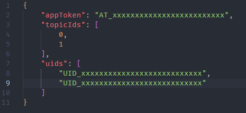

### 使用教程
***
1. 首先wxPuhser如何创建应用和主题可以看一下这篇帖子[Golang 爬取每日早报并推送到微信](https://www.52pojie.cn/thread-1658674-1-1.html)
2. 然后需要先运行一次软件，软件会在运行目录生成一个config.json，再将参数填入config.json中，如下图所示

### PS
***
要是嫌麻烦的，可以直接复制下面的链接在微信中打开，然后订阅一下主题，这样每周就能收到EPIC免费游戏的推送了

https://wxpusher.zjiecode.com/wxuser/?type=2&id=10793#/follow
